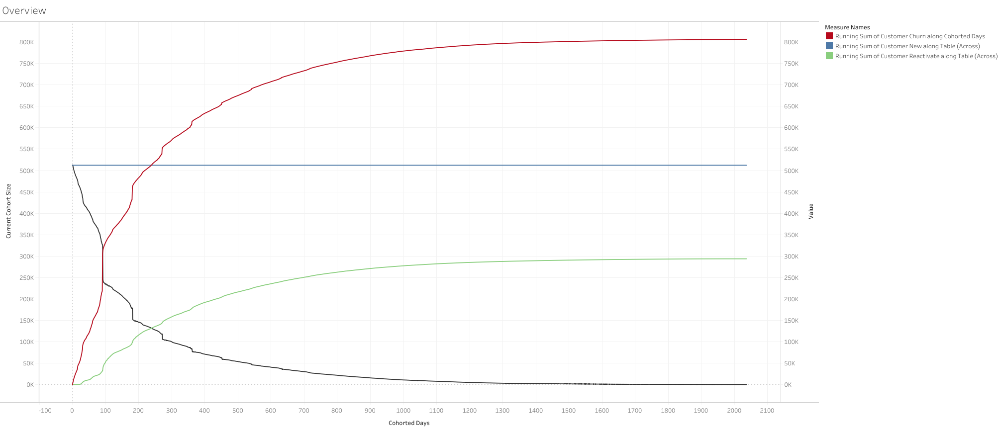
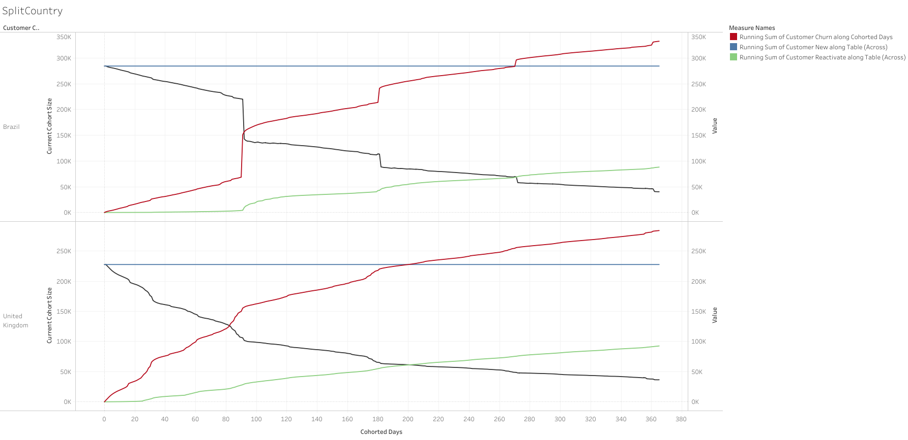
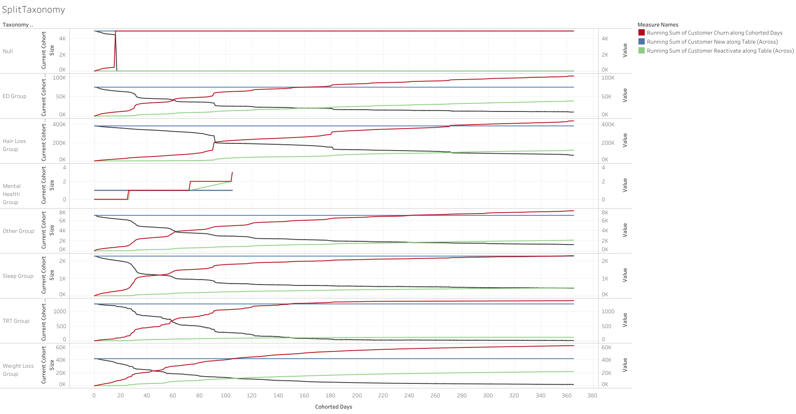
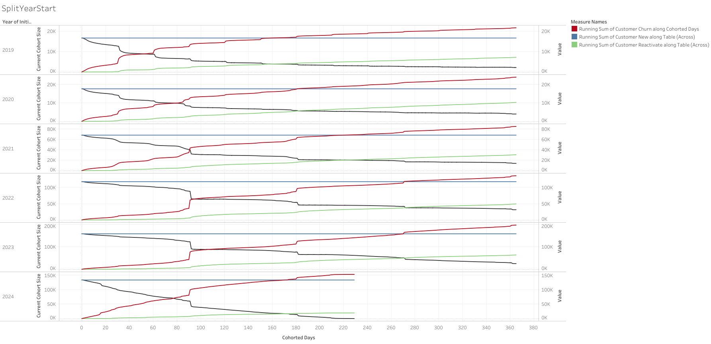
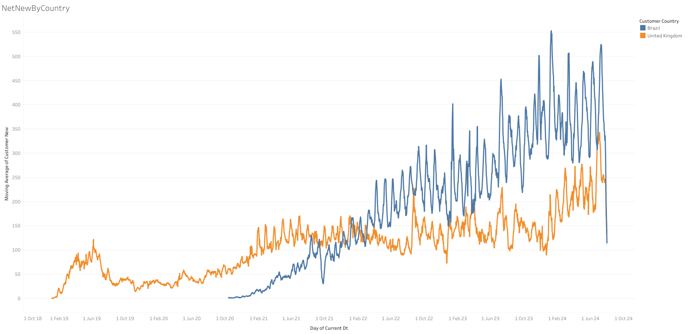
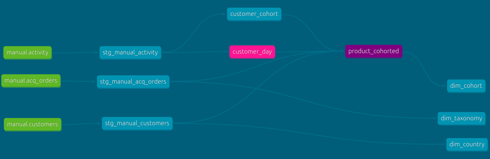

Sample retention/churn project
# Process
- Upload datasets to **Snowflake**
- Run some ad-hoc investigation queries
- Make some assumptions
- Build the models
- Explore them

# Assumptions
- customer always maintains the same taxonomy acquisition.
- there is no link between subscription and products, all assumed to be a similar line.
- not all customers will have a taxonomy, but they will have one at most.
- not all customers will have a country, but they will have one at most.
- Type of activities
    - New customer: a previous non-customer starts a subscription
    - Upsell/cross-sell (will be combined as there's no way to know): a current customer increases the number of subscriptions
    - Downsell: a current customer decreases the number of subscriptions, but still maintains at least one.
    - Churn: a customer that previously had at least one subscription now has none
    - Reactivation: a previously churned customer starts a subscription (original cohort remains as it was)
- Activity and subscriptions: understood as closed interval [from_to, to_date]. Unclear how to interpret same date in both sides.
    - e.g. the sample below is treated as active on 2020-01-01, 2020-01-02, 2020-01-03

    |customer|subscription|from_to|to_dt|
    |---|---|---|---|
    |1|1|2020-01-01|2020-01-02|
    |1|1|2020-01-02|2020-01-02|
    |1|1|2020-01-02|2020-01-03|
    

# Decissions
- Front load compute on elt to facilitate reporting.
- Create a rolled up model (`product_cohorted`) for reporting that contains the given dimensions (country, initial cohort, taxonomy) at dt level with the relevant measures (for the flags above).
- Create an intermediate model with grain customer-day that can be further enhanced / used for specific customer exploration.
- The dimensional tables can be used to facilitate filtering, etc. 
- To compute churn_rate on the fly, the `dim_cohort` table can be combined with the `product_cohorted` model.
- All customers have churned one day after the last day we have date for.
- Churn flag to detect all churns for a customer (so if a customer reactivates and then churns again it can have multiple churn flags -- the total number of churns = new customers + reactivated)

# examples
Sample usage showing overall cohorted survival (black = size of customer pool at X days after initial subscription; blue = initial cohort size = acquired customers; green = reactivated customers; red = cumulative churn = green + blue)

This can easily be split by the relevant dimensions and filtered to just 1 year after the beginning of the cohort, e.g. country

or by taxonomy, which shows differences in the churn pattern --maybe the purchase package is 3 months instead of for hair loss? 

or cohort year

The same source can be leveraged to evaluate new customers over time (e.g. showing a weekly moving average and limiting the data until end of July)

or a table showing churn rates by "cycle" (cycle here defined as periods of 30 days after the cohort start date)

# lineage
